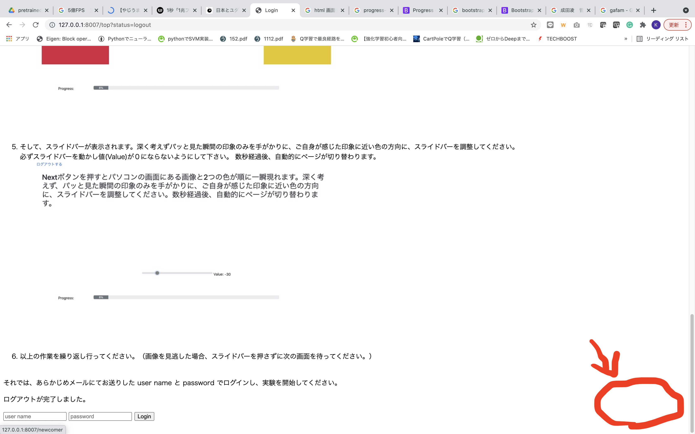

# contents-annotation

画像の印象を付与するアノテーションツール

アノテーションツールの動画イメージ

https://user-images.githubusercontent.com/60802703/134452838-0d658a8e-51a9-47a2-b519-ea39887afa54.mov


## How to start 
#### Initialize databases　
まずデータベースの初期化を行う。
```
% python
>>> from models.database import init_db
>>> init_db()
>>> exit()
```
次に以下のコードを実行して
```
python run.py
```
以下のページにアクセスし、インストラクションに従う。

access to http://192.168.101.7:8000/top

## app/templates/Image
app/templates/Image に表示する画像を入れているが、gitignoreしている。表示している画像は以下のデータセット。
* 手塚データセットは、[link](https://keio.app.box.com/s/s3pbq6na714vbbsh4hjuje267agrb74k). 
* DomainNetのSketchは、[link](http://ai.bu.edu/M3SDA/). 
* 色画像は、[link](https://www.color-sample.com/)、[link](http://machizukan.net/DK/bg_color_jis/file.pdf)

## Others
### docker

tsugaikeにすでにあるものを使用する。コンテナの作成(nameは自分で指定する。)
```
nvidia-docker run -it -v `pwd`:/workspace/sample --net=host --shm-size 8G --name annotation annotation:gpu
```


### jupyterlabの起動
```
cd /workspace/sample/
jupyter lab --allow-root --ip=* --no-browser
```


#### check the database
```
% sqlite3 models/impression.db
sqlite> Select * from impressioncontents;
```


### 新規ユーザ登録(optional)

トップページの右側に白文字で「新規登録はこちら」の記載があるので、ここをクリックすることで新たなユーザを登録することが可能


<!--  -->

